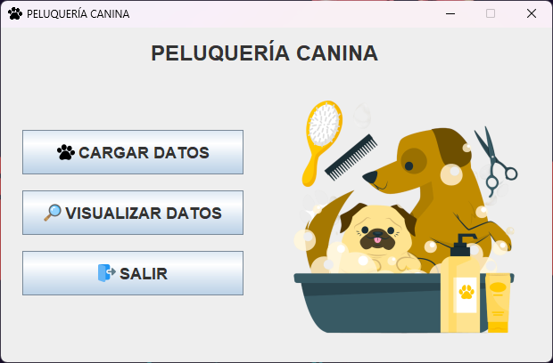
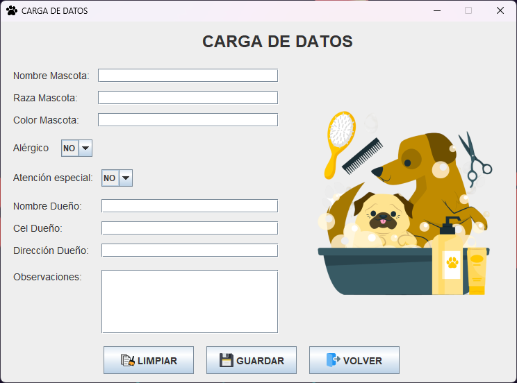
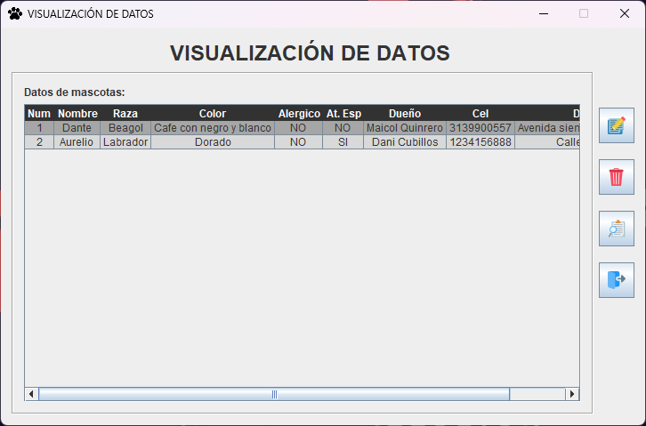
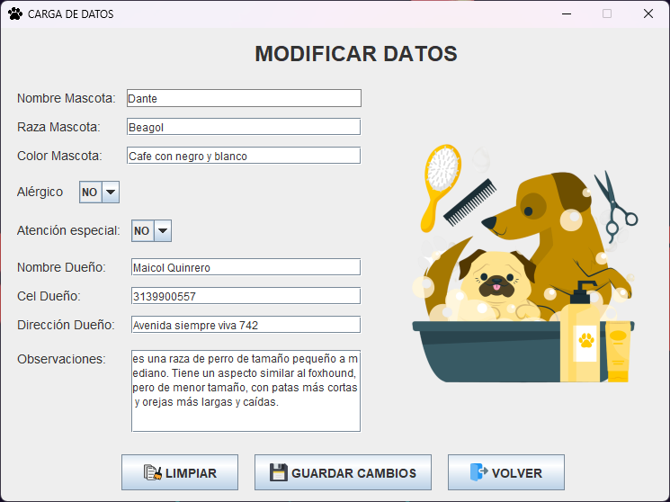
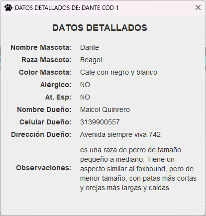

<h1 align="center">🐾🐶 DOG GROOMING 🐶🐾</h1>
<h4 align="center"><a href="https://github.com/SantyCubillos/PeluqueriaCanina">haga clic para ver los pasos de instalación en Español</a></h4>

Dog Grooming is a desktop application developed in Java, designed to manage the information of the pets to which the grooming service is provided. This application is based on a tutorial project from the TodoCode YouTube channel, created by the engineer and teacher Luisina de Paula, and has been extended and improved by Santiago Cubillos Sarmiento with the following features:

<ul>
  <li><strong>Data Validation: </strong>Validations have been implemented in the forms to guarantee the integrity of the information entered.</li>
  <li><strong>Detailed Data Window: </strong>Muestra de forma clara y concisa todos los detalles de una mascota seleccionada.</li>
  <li><strong>Highlighting of selected record: </strong>The selected pet record is visually highlighted for easy identification.</li>
  <li><strong>Confirmation of deletion: </strong>A confirmation is requested from the user before deleting a pet.</li>
</ul>

For the development of this application we used Java Swing for the graphical interface and JPA with EclipseLink to connect the application with a MySQL database, allowing to store and retrieve data efficiently.

<h2>🧑🏻‍💻 Main Functionalities</h2>

<h3>Main Window</h3>

Displays the Load Data, View Data and Exit buttons.

<h3>Data Loading</h3>

Allows you to enter the information of a new pet and its owner, with validations to ensure that the data is correct.

<h3>Data Visualization</h3>

Displays a list of all registered pets, allowing you to view, edit or delete a pet's data.

<h3>Modify or Update Data</h3>

Allows you to modify the information of an existing pet in the database.

<h3>Detailed Data</h3>

Displays detailed information for a specific or selected pet in the Data Display window.

<h2>💻 Technologies Used</h2>

<ul>
  <li><strong>Java 21: </strong>Main programming language.</li>
  <li><strong>Java Swing: </strong>Framework for the creation of graphical interfaces.</li>
  <li><strong>JPA with EclipseLink: </strong>For data persistence and database connection.</li>
  <li><strong>MySQL: </strong>Relational database for information storage</li>
  <li><strong>Maven: </strong>Dependency manager for easy management of the libraries used.</li>
  <li><strong>XAMPP: </strong>Local development environment including Apache, MySQL and PHP.</li>
</ul>

<h2>📝 Requirements</h2>

<ul>
  <li><strong>Local server: </strong>XAMPP, WAMPServer or similar to run the MySQL database.</li>
  <li><strong>JDK 21 or higher: </strong>Java Development Kit to run the application.</li>
</ul>

<h2>💻 Installation</h2>
  <ol>
    <li><h3>Download Dog Grooming</h3>
      <ul>
        <h3>Clone from GitHub</h3>
        <li>If you have Git installed on your computer. Open a terminal or command line and navigate to the folder where you want to save the application. Then, run the command:
          <pre><code>git clone https://github.com/SantyCubillos/peluqueriacanina.git</code></pre>
        </li>
         <h3>Download from GitHub</h3>
        <li>If you don't want to use Git, you can download the application as a ZIP file from GitHub. Go to the repository, look for the “Code” button and select “Download ZIP”. Unzip the file to the folder of your choice.</li>
        <a href="https://github.com/SantyCubillos/peluqueriacanina.git">Descargar Peluquería Canina</a>
      </ul>
    </li>
    <li><h3>Import and Configure the Database:</h3>
      <ul>
        <li>Inside the application files, look for a folder called “bd” or similar. The database file peluqueriacanina.sql should be there.</li>
        <li>Open your local server, click on the “Import” button and select the file peluqueriacanina.sql.</li>
      </ul>
    </li>
    <li><h3>Run the Application</h3>
      <ul>
        <li>Start your local server</li>
        <li>Click the 'Start' button on Apache and MySQL</li>
        <li>Find the executable in the target folder, then double-click on it to open it.</li>
      </ul>
    </li>
  </ol>

<h2>📥 Resources</h2>

Click on the list below to download resources.

<ul>
  <li><a href="http://www.oracle.com/co/java/technologies/downloads/">JDK 21 or higher</a></li>
</ul>

<h2>🪪 Authors:</h2>

<ul>
  <li><a href="https://github.com/todocodeacademy"><strong>Engineer and Professor Luisina de Paula:  </strong>Developer and programmer of the base project.</a></li>
  <li><a href="https://github.com/SantyCubillos"><strong>Santiago Cubillos Sarmiento: </strong>Developer of the improvements and extensions.</a></li>
</ul>