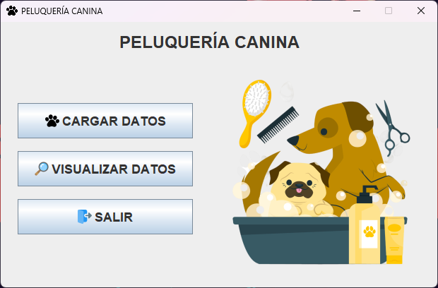
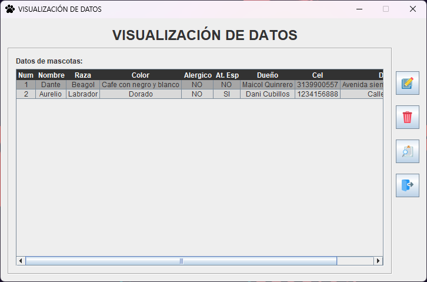
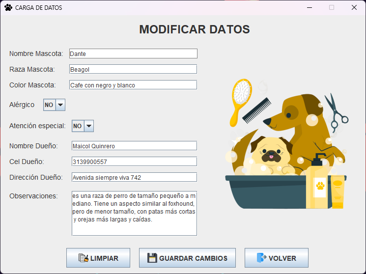
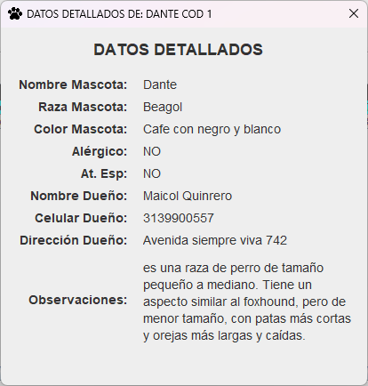

<h1 align="center">🐾🐶 PELUQUERÍA CANINA 🐶🐾</h1>
<h4 align="center"><a href="https://github.com/SantyCubillos/PeluqueriaCanina/blob/main/dog-grooming.md">click to see the installation steps in English</a></h4>

Peluquería Canina es una aplicación de escritorio desarrollada en Java, diseñada para gestionar la información de las mascotas a las que se les presta el servicio de peluquería. Esta aplicación se basa en un proyecto tutorial del canal de YouTube TodoCode, creado por la Ingeniera y Profesora Luisina de Paula, y ha sido extendida y mejorada por Santiago Cubillos Sarmiento con las siguientes funcionalidades:

<ul>
  <li align="justify"><strong>Validación de Datos: </strong>Se han implementado validaciones en los formularios para garantizar la integridad de la información ingresada.</li>
  <li align="justify"><strong>Ventana Datos Detallados: </strong>Muestra de forma clara y breve todos los detalles de una mascota seleccionada.</li>
  <li align="justify"><strong>Resaltado de registro seleccionado: </strong>El registro de la mascota seleccionado se destaca visualmente para facilitar su identificación.</li>
  <li align="justify"><strong>Confirmación de eliminación: </strong>Se solicita una confirmación al usuario antes de eliminar una mascota.</li>
</ul>

Para el desarrollo de esta aplicación se utilizo Java Swing para la interfaz gráfica y JPA con EclipseLink para conectar la aplicación con una base de datos MySQL, permitiendo almacenar y recuperar datos de manera eficiente.

<h2>🧑🏻‍💻 Funcionalidades Principales</h2>

<h3>Ventana Principal</h3>

Muestra los botones de Carga de datos, Visualización de datos y Salir.

<h3>Carga de Datos</h3>

Permite ingresar la información de una nueva mascota y su dueño, con validaciones para asegurar que los datos sean correctos.

<h3>Visualización de Datos</h3>

Muestra una lista de todas las mascotas registradas, permitiendo consultar, editar o eliminar los datos de una mascota.

<h3>Modificar o Actualizar Datos</h3>

Permite modificar la información de una mascota existente en la base de datos.

<h3>Datos Detallados</h3>

Muestra información detallada de una mascota específica o seleccionada en la ventana de Visualización de datos.

<h2>💻 Tecnologías Utilizadas</h2>

<ul>
  <li align="justify"><strong>Java 21: </strong>Lenguaje de programación principal.</li>
  <li align="justify"><strong>Java Swing: </strong>Framework para la creación de interfaces gráficas.</li>
  <li align="justify"><strong>JPA con EclipseLink: </strong> Para la persistencia de datos y la conexión con la base de datos.</li>
  <li align="justify"><strong>MySQL: </strong>Base de datos relacional para almacenar la información.</li>
  <li align="justify"><strong>MySql Connector J 8.4.0: </strong>Controlador JDBC para establecer la conexión entre la aplicación Java y la base de datos MySQL.</li>
  <li align="justify"><strong>Maven: </strong>Gestor de dependencias para facilitar la gestión de las librerías utilizadas.</li>
  <li align="justify"><strong>XAMPP: </strong>Entorno de desarrollo local que incluye Apache, MySQL y PHP.</li>
</ul>

<h2>📝 Requisitos</h2>

<ul>
  <li align="justify"><strong>Servidor local: </strong>XAMPP, WAMPServer o similar para ejecutar la base de datos MySQL.</li>
  <li align="justify"><strong>JDK 21 o superior: </strong>Kit de desarrollo de Java para ejecutar la aplicación.</li>
</ul>

<h2>💻 Instalación</h2>

<h3>Ejecutar la aplicación</h3>
  <ol>
    <li align="justify"><h3>Descargar Peluquería Canina</h3>
      <ul>
        <h3>Clonar desde GitHub</h3>
        <li align="justify">Si tienes Git instalado en tu computadora. Abre una terminal o línea de comandos y navega a la carpeta donde quieres guardar la aplicación. Luego, ejecuta el comando:
          <pre><code>git clone https://github.com/SantyCubillos/PeluqueriaCanina.git</code></pre>
        </li>
        <h3>Descargar desde GitHub</h3>
        <li align="justify">Si no quieres usar Git, puedes descargar la aplicación como un archivo ZIP desde GitHub. Ve al repositorio, busca el botón "Code" y selecciona "Download ZIP". Descomprime el archivo en la carpeta que desees.</li>
        <a href="https://github.com/SantyCubillos/PeluqueriaCanina.git">Descargar Peluquería Canina</a>
      </ul>
    </li>
    <li align="justify"><h3>Importar y Configurar la Base de Datos:</h3>
      <ul>
        <li align="justify">Dentro de los archivos de la aplicación, busca una carpeta llamada "bd" o similar. Allí debería estar el archivo de la base de datos peluqueriacanina.sql</li>
        <li align="justify">Abre tu servidor local, haz clic en el botón "Importar" y selecciona el archivo peluqueriacanina.sql</li>
      </ul>
    </li>
    <li align="justify"><h3>Ejecutar la Aplicación</h3>
      <h3>Abrir el ejecutable</h3>
      <ul>
        <li align="justify">Inicializa tu servidor local</li>
        <li align="justify">Da clic en el botón 'Start' en Apache y MySQL.</li>
        <li align="justify">Buscar el ejecutable en la carpeta target, luego haz doble clic sobre él para abrirlo.</li>
      </ul>
    </li>
  </ol>

<h2>📥 Recursos</h2>

Da clic en la siguiente lista para descargar los recursos

<ul>
  <li><a href="http://www.oracle.com/co/java/technologies/downloads/">JDK 21 o Superior</a></li>
</ul>

<h2>🪪 Autores</h2>

<ul>
  <li align="justify"><a href="https://github.com/todocodeacademy"><strong>Ingeniera y Profesora Luisina de Paula: </strong>Desarrolladora y programadora del proyecto base.</a></li>
  <li align="justify"><a href="https://github.com/SantyCubillos"><strong>Santiago Cubillos Sarmiento: </strong>Desarrollador de las mejoras y extensiones.</a></li>
</ul>